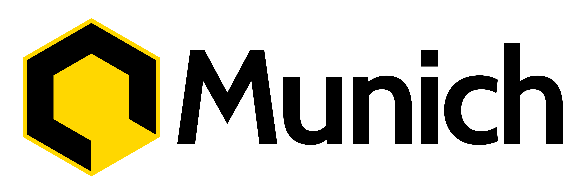

# 
#  The Munich Project
#### The new core for reemplace WDK 
#
#### What is Munich?
##### Munich is compilation or core  JS Scripts for Electron 
#
#### Use ?
##### Munich  use for functions esencially and simple for electron apps or create sample web browsers
#
#### What use technologies ?
##### Munich only use Javascript for the code
#
#### What munich reemplace WDK ?
##### The WDK core is  very very lazy and difficult maintainer for devs 
